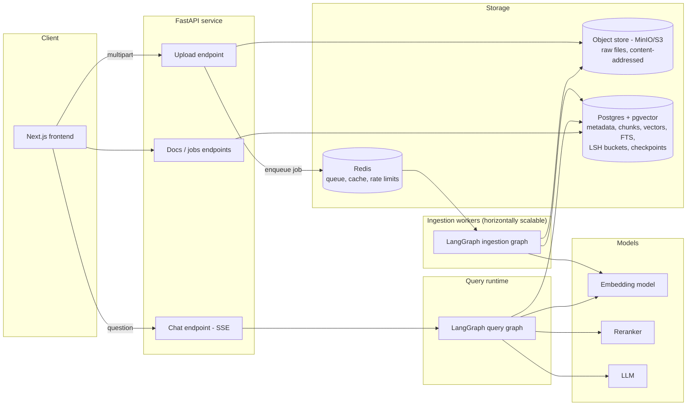
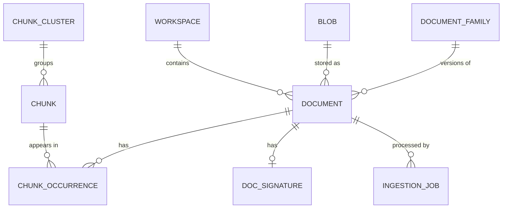
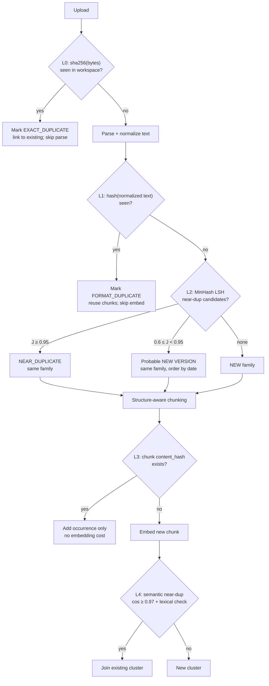
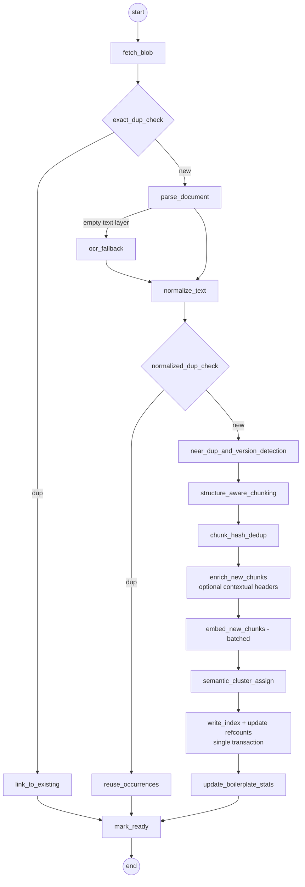
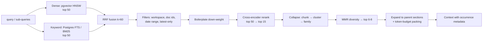
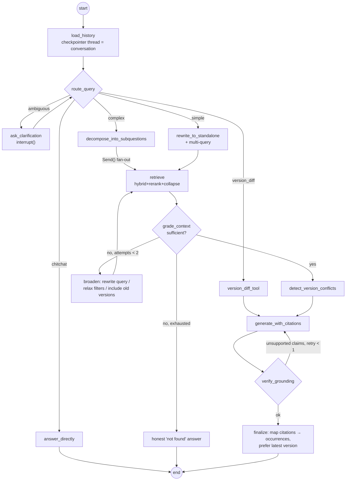

# RAG Graph Pipeline — Project Plan

A document Q&A system: upload documents, ask questions, get grounded answers with citations.
The goal is a system that **scales to a large, messy corpus that contains duplicates, versions and
heavy repetition**, orchestrated with **LangGraph**. This plan is also a learning roadmap. Each phase
teaches one concept and leaves you with something that works.

Existing scaffold: `backend/` (Python 3.13, uv) and `frontend/` (Next.js 16, React 19, Tailwind 4).

---

## 1. Problem framing: why naive RAG breaks here

A naive pipeline (parse → fixed-size chunks → embed → top-k → LLM) assumes every chunk is unique and
equally trustworthy. Real corpora break that assumption in several ways:

| Kind of repetition | Example | What goes wrong in naive RAG |
|---|---|---|
| **Exact file duplicate** | Same PDF uploaded twice, or by two users | Double storage and embedding cost; top-k filled with identical hits |
| **Format duplicate** | Same report as PDF and DOCX | Hashes differ, so it is not caught; the same problem as above |
| **Near-duplicate** | Re-export with different header/footer, OCR noise, typo fixes | Same as above, and citations point at an arbitrary copy |
| **Versions** | Contract v1/v2/v3; 10-K for 2023 vs 2024 | Stale and current facts compete, so the answer can be **wrong** |
| **Boilerplate / partial overlap** | Legal disclaimers, templates, TOCs, email threads quoting earlier mails | Boilerplate dominates retrieval; relevant chunks get pushed out |
| **Semantic duplicates** | Same fact phrased differently across docs | Less diversity in context; wasted token budget |

Consequences to design against:
1. **Retrieval diversity collapse**: 8 near-identical chunks in top-k means recall of 1 source.
2. **Cost and index bloat**: embedding and storing the same text N times; ANN gets slower.
3. **Staleness and conflicts**: the answer mixes old and new versions.
4. **Provenance ambiguity**: which document should a citation point at?
5. **Deletion correctness**: deleting one copy must not break the others.

**Core design idea:** separate *content* (unique text, stored and embedded once) from *occurrences*
(where that content appears: which document, page, section, version). Dedup happens at several
granularities, at **ingestion time** (to save cost) and at **retrieval time** (to protect quality).

---

## 2. High-level architecture



Two LangGraph graphs:
- **Ingestion graph** runs in background workers: parse, dedup, chunk, embed, index. It is checkpointed so a crashed job resumes instead of restarting.
- **Query graph** runs per chat turn: route, rewrite, retrieve, grade, generate, verify. It is checkpointed per conversation (memory).

---

## 3. Tech stack (recommended defaults + alternatives)

| Concern | Default choice | Why | Alternatives |
|---|---|---|---|
| API | **FastAPI** + Uvicorn | Async, typed, SSE streaming | Litestar |
| Orchestration | **LangGraph** (+ LangChain core interfaces) | Stateful graphs, loops, fan-out (`Send`), checkpoints, `interrupt()` | Hand-rolled state machine |
| Relational + vector + keyword | **Postgres 16 + pgvector (HNSW)** + FTS (`tsvector`) | One DB for metadata, vectors, keyword search, LSH buckets, LangGraph checkpoints. Simple ops, transactional dedup | Qdrant/Weaviate (vectors), ParadeDB `pg_search` / OpenSearch (true BM25) |
| Object storage | **MinIO** locally (S3 API) | Content-addressed blobs (`sha256` key) | S3/GCS in prod |
| Task queue | **Celery + Redis** | Retries, rate limits, concurrency controls | Dramatiq; Temporal for durable workflows |
| Parsing | **Docling** (layout, tables, OCR) with a **PyMuPDF** fast path | Structure-aware parsing matters for good chunks | Unstructured, LlamaParse |
| Near-dup detection | **datasketch** (MinHash), custom LSH tables in Postgres | Standard, explainable, scalable | SimHash |
| Embeddings | Local **bge-m3** (sentence-transformers) *or* hosted Voyage AI | Local = free and private; hosted = better quality, no GPU needed | OpenAI, Cohere |
| Reranker | **bge-reranker-v2-m3** (local cross-encoder) | Largest quality jump per unit of effort | Cohere / Voyage rerank |
| LLM | **Claude Sonnet 5** (`claude-sonnet-5`) for generation; **Haiku 4.5** (`claude-haiku-4-5-20251001`) for routing, grading, verification | Cheap model for high-volume judgments, strong model for the answer | Any LangChain chat model |
| Tracing | **Langfuse** (self-host) or LangSmith | See every node, prompt, token and latency | OpenTelemetry |
| Eval | **RAGAS** + custom metrics + pytest | Regression-test the pipeline | DeepEval |
| Local infra | **docker compose** | One command to bring everything up | — |

Keep the LLM, embedder and reranker behind small interfaces (`Embedder`, `Reranker`, `ChatModel`)
so you can swap them and compare in evals.

---

## 4. Data model



| Table | Key columns | Purpose |
|---|---|---|
| `workspaces` | id, name | Tenant/collection boundary. Chunk dedup scope stays **inside** a workspace (ACL safety + simple deletion) |
| `blobs` | **sha256 (PK)**, size, mime, storage_uri, ref_count | Raw bytes stored once, globally |
| `documents` | id, workspace_id, blob_sha256, filename, title, doc_date, status, `normalized_text_hash`, `family_id`, `version_no`, `is_latest`, `duplicate_of`, `dedup_verdict`, metadata jsonb | One row per *upload*, even for duplicates (users expect to see their upload) |
| `document_families` | id, workspace_id, canonical_title, latest_document_id | Groups versions / near-duplicates |
| `doc_signatures` | document_id, minhash (bytea), num_perm, shingle_cfg | MinHash signature |
| `lsh_buckets` | band_idx, band_hash, document_id — index on (band_idx, band_hash) | LSH candidate lookup in plain SQL |
| `chunks` | id, workspace_id, **content_hash** (unique per workspace + embed model), text, token_count, `embedding vector(d)`, `embedding_model`, `tsv tsvector`, `cluster_id`, `occurrence_count`, `is_boilerplate` | **Unique content**, embedded once |
| `chunk_occurrences` | chunk_id, document_id, ordinal, page_start/end, section_path, parent_section_id | **Where** content appears; used for provenance and citations |
| `parent_sections` | id, document_id, text, section_path | Larger context blocks for parent-child retrieval |
| `chunk_clusters` | id, representative_chunk_id, size | Semantic near-duplicate groups |
| `ingestion_jobs` | id, document_id, state, attempt, last_error, idempotency_key, timings jsonb | Job tracking, retries, UI progress |
| `feedback` | message_id, rating, comment | Thumbs up/down to grow the eval set |
| *(LangGraph)* | managed by `PostgresSaver` | Conversation + ingestion checkpoints |

**Reference counting & deletion:** deleting a document removes its occurrences. It also decrements
`chunks.occurrence_count` and removes chunks at 0, decrements `blobs.ref_count` and removes blobs at
0, and updates `family.latest_document_id`. Do all of this in **one transaction**. This is the reason
for the content/occurrence split.

---

## 5. Deduplication strategy (the core of the project)

Layered from cheap/exact to expensive/fuzzy. Each layer catches what the previous missed.



### L0: Exact file dedup
- `sha256` of raw bytes computed while streaming the upload. It is also the object-store key (content-addressed).
- If the blob already exists in the workspace, create the `documents` row with `dedup_verdict=EXACT_DUPLICATE, duplicate_of=<doc>` and **short-circuit** the graph. Cost: near zero.

### L1: Normalized-text dedup (catches format duplicates)
- Normalize extracted text: Unicode NFKC, lowercase, collapse whitespace, strip repeated page headers/footers (lines repeating on more than 50% of pages), strip page numbers, and remove soft hyphens and ligatures.
- `sha256(normalized_text)`. A match means the same content in a different file format or export. Reuse all chunk occurrences of the original. Skip chunking and embedding.

### L2: Near-duplicate & version detection (MinHash + LSH)
- Shingles: 5-word shingles of normalized text (char 9-grams for short docs).
- MinHash with 128 permutations. LSH with **16 bands × 8 rows** gives a candidate threshold of about (1/16)^(1/8) ≈ 0.71 Jaccard. Store band hashes in `lsh_buckets`, so a candidate lookup is a single indexed SQL query. It scales to millions of docs with no extra service.
- Verify candidates with the estimated Jaccard from signatures. Then classify:
  - **J ≥ 0.95** → `NEAR_DUPLICATE` (re-export, OCR noise). Same family.
  - **0.6 ≤ J < 0.95** plus supporting signals (title/filename similarity, same doc type, different date) → `NEW_VERSION`. Same family. Order versions by `doc_date`, falling back to upload time. Update `is_latest`.
  - Otherwise → new family.
- Thresholds are **configurable** and tuned in the eval phase (section 12).
- Bonus feature: because versions share chunk hashes, a **version diff** is a diff over sequences of chunk hashes. That makes "what changed between v2 and v3?" answerable cheaply.

### L3: Chunk-level exact dedup (the workhorse)
- `content_hash = sha256(normalize(chunk_text))`, unique per (workspace, embedding_model).
- `INSERT ... ON CONFLICT (workspace_id, embedding_model, content_hash) DO NOTHING RETURNING id` makes it race-safe when many workers ingest overlapping docs concurrently.
- Only chunks that are actually new get embedded. On a versioned corpus this typically removes most embedding work.
- **Critical detail: content-defined chunk boundaries.** Fixed-offset chunking with overlap shifts every later boundary when one paragraph is inserted, and then *no* chunk hash matches. Anchor boundaries to structure (headings, paragraphs), so an edit only changes the chunks around it. This single decision makes or breaks L3 on versioned documents.

### L4: Semantic near-duplicate chunks (cluster, don't delete)
- After embedding a new chunk, run an ANN query for neighbors with cosine ≥ 0.97.
- **Guard against false positives**: "Revenue in 2023 was $5.1M" vs "$6.3M" embed almost identically. Require *also* token Jaccard ≥ 0.8 **and** identical sets of numbers/dates/named entities. Otherwise they are distinct facts.
- Matches join a `chunk_cluster`. Nothing is deleted. Clustering is used at retrieval time to collapse results.

### L5: Boilerplate detection
- If a chunk's `occurrence_count` spans more than N families (e.g. more than 5% of families), mark it `is_boilerplate`. Down-weight it at retrieval, like IDF applied to whole chunks. Disclaimers stop crowding out real content.

### L6: Retrieval-time dedup (quality safety net)
Even with perfect ingestion dedup, results need collapsing:
1. Collapse by `chunk_id` (many occurrences become one hit, carrying its occurrence list).
2. Collapse by `cluster_id` (keep the highest-scored member).
3. Collapse by `family_id` + section, preferring `is_latest=true` unless the query targets history.
4. **MMR** (λ≈0.7) over the remaining candidates for diversity.
5. Metric to track: **unique-source ratio in final context** (target > 0.8).

---

## 6. Ingestion graph (LangGraph #1)



**State sketch** (design only):

```python
class IngestState(TypedDict):
    job_id: str
    document_id: str
    workspace_id: str
    blob_sha256: str
    mime: str
    pages: list[PageText]            # parsed output (or a pointer to it if large)
    normalized_hash: str | None
    dedup_verdict: Literal["NEW", "EXACT_DUPLICATE", "FORMAT_DUPLICATE",
                           "NEAR_DUPLICATE", "NEW_VERSION"]
    family_id: str | None
    chunks: list[ChunkDraft]         # text, hash, section_path, pages
    new_chunk_hashes: list[str]      # only these get embedded
    errors: Annotated[list[str], operator.add]
```

**Resilience rules:**
- Every node is **idempotent**: re-running it after a crash gives the same result (upserts keyed by hashes, never blind inserts).
- LangGraph **checkpointer** (Postgres) per `job_id` lets a resumed job skip completed nodes.
- Node-level `RetryPolicy` for transient failures (embedding API 429/5xx) with exponential backoff and jitter.
- Hard timeouts on parse/OCR. "Poison" documents go to `status=FAILED` with the error after N attempts (dead-letter), and never block the queue.
- Large parsed payloads live in object storage or Postgres, not inline in graph state. Keep checkpoints small.

---

## 7. Chunking & enrichment

1. **Parse** with Docling to get headings, paragraphs, tables and page numbers. Use PyMuPDF as the fast path for simple PDFs, and OCR only when a page has no text layer.
2. **Structure-aware split**: split by heading hierarchy, then by paragraph, then recursively to ~300–500 tokens. Keep tables whole, or split them by rows with the header repeated. Store `section_path` (e.g. `"3. Risk Factors > 3.2 Market Risk"`).
3. **Parent-child**: retrieve small child chunks (precise matching) and pass their parent section (~1,500 tokens) to the LLM (complete context). Dedup applies to children. Parents are stored per occurrence.
4. **Contextual headers** ([Anthropic "Contextual Retrieval"](https://www.anthropic.com/news/contextual-retrieval)): prepend `doc title + section_path` (cheap) or a 1–2 sentence LLM-generated context (expensive) before embedding.
   - **Tradeoff with dedup**: context is per-document, while deduped chunks are shared across documents. Recommended: dedup on **raw** text, and build the context from the *first-seen* occurrence. Measure the effect in evals before paying for LLM-generated context.
5. **Metadata extraction**: title, date, author and doc type (heuristics first, cheap LLM as fallback). `doc_date` is essential for version ordering.

---

## 8. Retrieval pipeline



- **Hybrid matters**: dense search misses exact identifiers (contract numbers, error codes, names) and keyword search misses paraphrases.
- **Filters are pushed into SQL**, not applied after the ANN step. Otherwise filtered queries return too few results. Use pgvector iterative index scans or partial indexes.
- Every retrieved item carries **all its occurrences**, so the answer can say "found in *Policy v3* (latest), also in 4 other documents".

---

## 9. Query graph (LangGraph #2)



Node notes:
- **route_query** (Haiku, structured output): `{chitchat, ambiguous, simple, complex, version_diff, summarize_doc}`.
- **rewrite**: turn follow-ups ("what about 2022?") into standalone questions using history, and generate 2–3 query variants. HyDE is an optional experiment.
- **decompose + `Send`**: multi-hop questions ("compare the refund policy in doc A vs doc B") fan out into parallel retrievals and are merged with a reducer.
- **grade_context** (Corrective RAG): a cheap LLM judges whether the context can answer the question. A bounded loop avoids infinite retries. This is where you learn LangGraph cycles and conditional edges.
- **detect_version_conflicts**: if the context holds chunks from different versions of the same family that disagree, pass that to the generator explicitly, so the answer states the latest value and notes the change.
- **generate**: Sonnet, streaming, citations as `[c:<chunk_id>]` markers that are validated against the provided context.
- **verify_grounding** (Self-RAG style): check each sentence against the chunks it cites. Regenerate once with feedback, or drop unsupported sentences.
- **Memory**: `PostgresSaver` checkpointer, `thread_id = conversation_id`. Trim or summarize long histories.
- **Streaming**: stream both *tokens* and *node events* over SSE, so the UI can show "Searching… Grading… Writing…".

State sketch:

```python
class QAState(TypedDict):
    messages: Annotated[list[AnyMessage], add_messages]
    workspace_id: str
    route: str | None
    standalone_query: str | None
    sub_questions: list[str]
    retrieved: Annotated[list[RetrievedChunk], merge_dedup]  # custom reducer collapses dups
    attempts: int
    conflicts: list[VersionConflict]
    draft: str | None
    citations: list[Citation]
```

A **custom reducer** (`merge_dedup`) that collapses duplicate chunks when parallel branches merge is
a small piece of LangGraph worth learning in its own right.

---

## 10. API design

| Method | Path | Notes |
|---|---|---|
| `POST` | `/workspaces/{ws}/documents` | Multipart upload (streamed to S3 while hashing). Returns `{document_id, job_id, dedup_verdict?}`. Supports `Idempotency-Key` |
| `POST` | `/workspaces/{ws}/documents:batch` | Bulk upload / presigned-URL flow for large batches |
| `GET` | `/workspaces/{ws}/documents` | Filters: status, family, latest-only |
| `GET` | `/documents/{id}` | Includes dedup verdict, family, versions, occurrence stats |
| `GET` | `/documents/{id}/duplicates` | Duplicates and versions in the same family |
| `GET` | `/families/{id}/diff?from=&to=` | Chunk-level version diff |
| `DELETE` | `/documents/{id}` | Refcount-safe delete |
| `GET` | `/jobs/{id}` | Progress by node, errors |
| `POST` | `/workspaces/{ws}/chat` | SSE stream: node events, tokens, citations |
| `GET` | `/conversations/{id}` | History from the checkpointer |
| `POST` | `/messages/{id}/feedback` | Thumbs + comment |
| `GET` | `/health`, `/metrics` | Liveness, Prometheus metrics |

---

## 11. Frontend (Next.js)

1. **Library page**: drag-and-drop multi-file upload, per-file progress driven by job state, and badges such as `Duplicate of X`, `Version 3 of Y`, `Processing`, `Failed`. Dedup stats: storage saved, chunks reused.
2. **Document page**: metadata, family/version timeline, version diff view.
3. **Chat page**: streaming answers, clickable citations that open the source at the right page/section, and "also appears in N documents".
4. **Trace panel (learning aid)**: live view of which graph nodes ran, retrieved chunks with scores before and after rerank/collapse, and retries. This is what makes the system understandable.

Note: `frontend/AGENTS.md` warns that this Next.js version differs from older versions. Read
`node_modules/next/dist/docs/` before building.

---

## 12. Evaluation (build this early, in Phase 1)

**Corpus** (public, naturally repetitive):
- **SEC EDGAR 10-K filings**: ~20 companies × 5 years. You get real versions (year over year), heavy boilerplate and number-sensitive facts. Well suited to this project.
- A **synthetic duplication script** on top: exact copies, PDF↔DOCX conversions, header/footer noise, paragraph insertions/deletions, number edits (hard negatives for L4), and shuffled sections. Every generated file carries a ground-truth label.

**Gold QA set** (~150 questions, grown later from feedback): single-fact, multi-hop, version-sensitive
("latest reported revenue", "how did risk factor X change"), unanswerable, and identifier lookups.

| Area | Metrics |
|---|---|
| Dedup | Precision/recall per layer vs synthetic labels; false-merge rate on number-edited pairs (must be ~0) |
| Efficiency | Embedding calls saved %, storage saved %, ingestion docs/min |
| Retrieval | Recall@k, MRR, nDCG, **unique-source ratio**, **latest-version hit rate** |
| Generation | Faithfulness, answer relevance, citation precision/recall (RAGAS + LLM judge), "not found" correctness on unanswerables |
| System | p50/p95 latency per node, tokens and cost per query |

Keep a **results table per phase** (baseline naive RAG vs each improvement) in `docs/EVAL.md`. It is
the clearest record of what you learned.

---

## 13. Scalability & resilience

| Concern | Approach |
|---|---|
| Upload volume | Stream to object storage; presigned URLs for bulk; hash while streaming |
| Ingestion throughput | Stateless workers scale horizontally; separate queues for `parse` (CPU/OCR-heavy) and `embed` (GPU/API-bound) |
| Embedding cost | Only new chunk hashes are embedded; batch size 64–256; cache keyed by `(content_hash, model)` |
| Concurrency races | Unique constraints + `ON CONFLICT`; advisory lock per family when assigning versions |
| API rate limits | Token-bucket limiter in Redis shared across workers; retries with backoff and jitter |
| Crash recovery | Idempotent nodes + LangGraph checkpoints + job state machine; stuck-job reaper |
| Poison docs | Timeouts, max attempts, dead-letter status, visible in UI |
| Vector index | HNSW (`m=16, ef_construction=64`, tune `ef_search`); partition `chunks` by workspace; move to Qdrant beyond ~10–50M vectors |
| Model upgrades | `embedding_model` column + background re-embed job; dual-read during migration |
| Query latency | Parallel dense + keyword search; cheap model for routing/grading; cache query embeddings; stream early |
| Multi-tenancy | Workspace scoping in every query (consider Postgres RLS); never dedup chunks across workspaces |
| Observability | Langfuse traces per graph run; Prometheus metrics (queue depth, job durations, dedup ratios) |

Targets to prove at the end: **ingest 10k+ documents** with 30–50% duplication and survive a killed
worker mid-run with no data loss or double counting. Retrieval quality must not degrade as duplicates
increase (plot recall vs duplication rate for naive vs this system).

---

## 14. Proposed backend structure

```
backend/
  src/backend/
    api/              # FastAPI routers, SSE, schemas
    core/             # config (pydantic-settings), logging, db session, storage client
    models/           # SQLAlchemy models + Alembic migrations
    ingestion/
      graph.py        # LangGraph ingestion graph
      nodes/          # parse, normalize, dedup, chunk, embed, index
      dedup/          # hashing, minhash_lsh, semantic_cluster, boilerplate
      chunking/       # structure-aware, parent-child
    retrieval/        # hybrid search, rrf, rerank, collapse, mmr
    query/
      graph.py        # LangGraph query graph
      nodes/          # route, rewrite, decompose, grade, generate, verify
      prompts/
    providers/        # Embedder / Reranker / ChatModel interfaces + impls
    workers/          # Celery app, task entrypoints
  eval/               # corpus builder, dup injector, QA set, runners
  tests/              # unit (dedup, chunking) + integration (graphs)
docker-compose.yml    # postgres+pgvector, redis, minio, langfuse
```

---

## 15. Roadmap

Each phase has a learning focus and a *done when* criterion. Don't skip Phase 1. The baseline is what
shows you whether the later work helped.

| Phase | Build | Learn | Done when |
|---|---|---|---|
| **0. Foundations** | docker compose (PG+pgvector, Redis, MinIO); FastAPI skeleton; config; Alembic; health check | Project setup, pgvector basics | `docker compose up` + `/health` green |
| **1. Naive baseline + eval harness** | Synchronous upload → parse → fixed chunks → embed → top-k → answer. Build the 10-K corpus, the dup injector and the QA set | RAG fundamentals; *seeing* the duplicate problem in numbers | Baseline metrics recorded in `EVAL.md` |
| **2. Async ingestion + exact dedup** | Celery workers; job table; L0, L1, L3 dedup; content/occurrence model; refcounted delete; content-defined chunking | Idempotency, content addressing, race-safe upserts | Re-uploading the corpus costs ~0 embeddings; delete is correct |
| **3. Ingestion as a LangGraph graph** | Port the pipeline to a `StateGraph` with conditional edges, retries and checkpointing | StateGraph, conditional edges, checkpointers, RetryPolicy | Kill a worker mid-job; it resumes from the last node |
| **4. Near-dup + versions + boilerplate** | MinHash/LSH in Postgres; families and version ordering; L4 semantic clusters with number guards; L5 boilerplate; version diff | LSH math, similarity thresholds, false-positive control | Dedup precision/recall ≥ 0.95 on synthetic labels; 0 false merges on number edits |
| **5. Retrieval quality** | Hybrid search + RRF; reranker; collapse chain; MMR; parent-child; filters | Hybrid retrieval, rerankers, diversity | Recall@k and unique-source ratio beat baseline, and stay flat as duplication grows |
| **6. Agentic query graph** | Router, rewrite, decompose (`Send`), CRAG loop, conflict detection, grounded generation, verification, memory, `interrupt()` for clarification, SSE streaming | Cycles, fan-out/fan-in, reducers, HITL, streaming | Faithfulness and version-sensitive accuracy beat Phase 5 |
| **7. Frontend** | Library, document/version pages, chat with citations, trace panel | Streaming UI, SSE | End-to-end demo on the 10-K corpus |
| **8. Observability + hardening** | Langfuse, Prometheus metrics, rate limiting, dead-letter, load test (10k docs, concurrent chats), failure injection | Operating a system, not just building one | Scale targets from section 13 met |
| **9. Stretch** | Contextual retrieval A/B; GraphRAG-style entity graph; workspace ACLs/RLS; re-embedding migration; expose as an MCP server; feedback-driven eval growth | Advanced RAG | Pick based on interest |

The frontend can start in parallel from Phase 2 if you want visible progress earlier. A minimal upload +
chat UI is enough until Phase 7.

---

## 16. Pitfalls checklist

- [ ] Fixed-offset chunking with overlap silently defeats chunk-level dedup on versioned docs → use structure-anchored boundaries.
- [ ] Semantic dedup merging chunks that differ only in numbers or dates → numeric/entity guard; cluster instead of delete.
- [ ] Deduping across tenants leaks existence of content → scope chunk dedup per workspace.
- [ ] Deleting a document orphans or deletes shared chunks → refcounts in one transaction.
- [ ] Post-filtering ANN results → too few hits for filtered queries → filter inside SQL.
- [ ] Stale version answers → `is_latest` preference + conflict detection + dates in the prompt.
- [ ] Unbounded CRAG/verify loops → attempt counters in state, recursion limit.
- [ ] Huge graph state (full text in checkpoints) → store pointers, not payloads.
- [ ] Embedding model change mixes vector spaces → `embedding_model` column; never compare across models.
- [ ] Tuning thresholds by feel → tune against the labeled synthetic corpus.

---

## 17. Decisions to make before Phase 0

1. **Models**: hosted LLM (Claude) plus local embeddings/reranker (free, needs ~4–8 GB RAM), or fully hosted?
2. **Scale target**: laptop-scale (~10k docs) or design-for-prod (~1M docs)? This affects pgvector vs Qdrant and partitioning.
3. **Tenancy**: single user, or workspaces with auth from the start?
4. **Document types**: PDF/DOCX/TXT/MD only, or also HTML, emails, scanned images (OCR)?

## 18. Reading list

- LangGraph docs: StateGraph, conditional edges, `Send`, reducers, checkpointers (`PostgresSaver`), `interrupt()`, streaming modes
- Anthropic: *Introducing Contextual Retrieval* (2024)
- Corrective RAG (Yan et al., 2024) and Self-RAG (Asai et al., 2023)
- *Mining of Massive Datasets*, ch. 3: shingling, MinHash, LSH
- Broder (1997): *On the resemblance and containment of documents*
- Cormack et al. (2009): Reciprocal Rank Fusion
- Carbonell & Goldstein (1998): Maximal Marginal Relevance
- pgvector README: HNSW tuning, iterative index scans
- RAGAS docs: faithfulness, context precision/recall
